# Risoluzione numerica di un sistema di equazioni differenziali ordinarie
Lo scopo di questo progetto è la risoluzione numerica di un sistema lineare di ODE (ordinary differential equations) caratterizzato dall'avere un alto coefficiente 
di stiffness ed essere pertanto soggetto a generare una forte instabilità numerica se approcciato con un metodo numerico non consono. 
Il problema è stato risolto con vari algoritmi numerici e con vari tipi di mesh. Come mostrano i risultati, la A-stabilità ed, ancor più, la L-stabilità
sono due proprietà fortemente desiderabili in un algoritmo risolutore, infatti, in loro assenza si rende necessario utilizzare un numero esorbitante 
di nodi per approssimare numericamente la soluzione. I metodi numerici che godono solo della zero-stabilità si sono rivelati assolutamente non 
in grado di approssimare efficacemente la soluzione, coerentemente con le previsioni teoriche.  
I codici sono stati implementati in linguaggio MATLAB, tuttavia, essendo tutti gli algoritmi stati scritti from scratch (da zero) utilizzando 
unicamente la libreria standard di MATLAB, i codici risultano pienamente compatibili sia con le licenze base di MATLAB 
(senza la necessità di specifici toolbox a pagamento), sia con il software open-source GNU Octave.  
Inoltre, una [relazione](./Analisi_di_stabilità.pdf) molto più dettagliata di questo file README è stata inserita nel repository in formato PDF.  
Sia i codici che la relazione sono stati sviluppati come progetto individuale.

## Il problema

Si consideri il problema di Cauchy

$$
y \hspace{0.1cm}'(t)=M \cdot y(t), \qquad y(t_0)=y_0,
$$

dove M è definita come la matrice di dimensione $15 \times 15$, avente come $j$-esimo elemento della diagonale principale il valore $-j^2$ e come elementi 
della sovradiagonale i valori $150$:

$$
M :=
\begin{pmatrix}
-1     & 150    & 0      & \cdots    & 0 \\
0      & -4     & 150    & \cdots    & 0 \\
0      & 0      & -9     &           & \vdots \\
\vdots & \vdots &        & \ddots    & 150 \\
0      & 0      & \cdots & 0         &-225
\end{pmatrix}.
$$

e dove

$$
\underline{y_0} = \[ 1, 1, 1, ..., 1, 10 \]^T 
$$

da risolvere per $t \in \[ t_0 , T \]$,  con $T$ fissato e scelto nell'intervallo $\[ 10 , 10000 \]$.  
Per calcolare numericamente la soluzione, l'intervallo temporale $[t_0,T]$ viene suddiviso in una successione di nodi:  

$$
t_0 < t_1 < \cdots < t_N=T ,
$$

chiamata *mesh* e su ogni nodo della mesh viene approssimato il valore della funzione (vettoriale).  
La distanza $h_n=t_{n+1}-t_n$ tra due nodi consecutivi viene detta *passo di discretizzazione*, se il passo di discretizzazione è lo stesso per 
tutti i nodi della mesh, la mesh viene detta *uniforme* oppure *omogenea*.


## Analisi teorica a priori

$M$ ha $15$ autovalori distinti ed ha spettro: $\sigma (M) = \\{ −1,−4,…,−225 \\} $, in particolare, tutti e $15$ i suoi autovalori sono reali negativi e 
pertanto il sistema di ODE in esame descrive una dinamica asintoticamente stabile per il teorema di Lyapunov.  
Tuttavia, la scrittura della soluzione come combinazione lineare di termini della forma $e^{\lambda_i \cdot (t- t_0) } \cdot v_i$ mostra l'esistenza di transitori veloci e transitori lenti, in altre parole, il problema forza l'utilizzo di tantissimi nodi negli istanti iniziali, mentre negli istanti finali sono necessari
molti meno nodi per approssimare efficacemente la soluzione. Conseguenza diretta di ciò è che utilizzare una mesh omogenea potrebbe non essere la scelta più 
vantaggiosa.  
Come noto dall'analisi, i sistemi lineari di equazioni differenziali ordinarie ammettono come soluzione esatta 
$y(t) = \exp( M \cdot (t - t_0)) \cdot y_0$, dove:

$$
\exp(A) := \sum_{k=0}^{+ \infty} \frac{A^k}{k!}
$$

La funzione $\exp(A)$ è detta esponenziale di matrice della matrice $A$, ed in MATLAB è calcolabile mediante la funzione di libreria standard *expm*.  

Il coefficiente di stiffness del sistema vale:

$$
C_{stiff} = \frac{ \max\limits_{i=1,\ldots,15} \left| Re( \lambda_i ) \right| }{ \min\limits_{i=1,\ldots,15} \left| Re( \lambda_i ) \right| } = 225 \gg 1
$$

Dal momento che il coefficiente di stiffness è così elevato si può catalogare questo sistema di ODE come problema stiff.

La soluzione esatta è la seguente:  

<p align="center">
  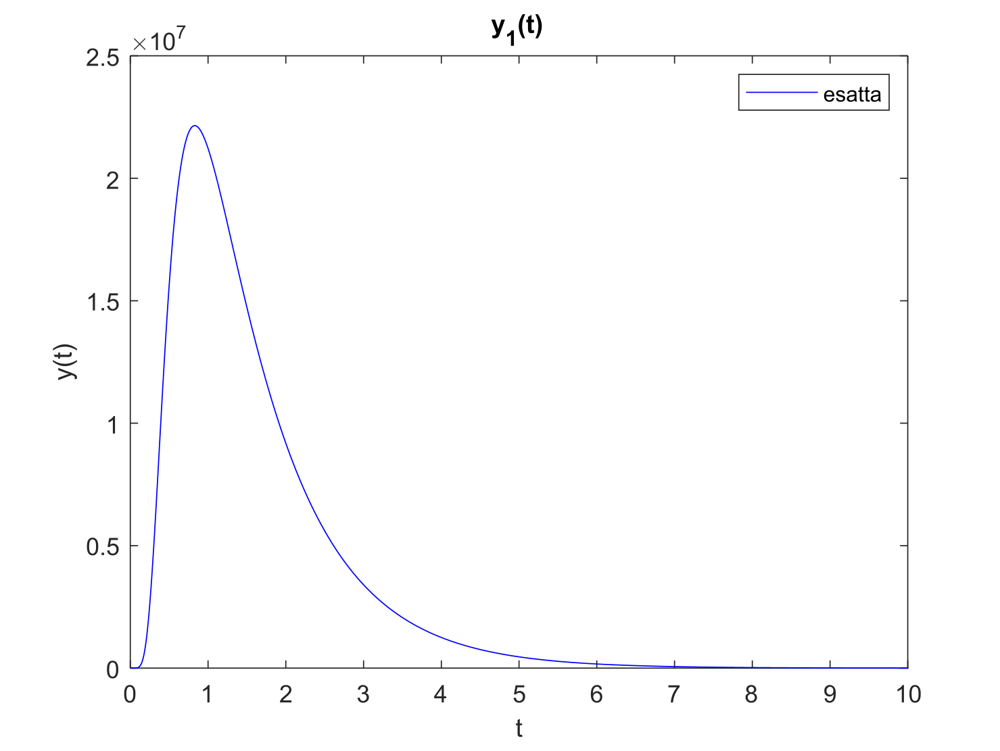
  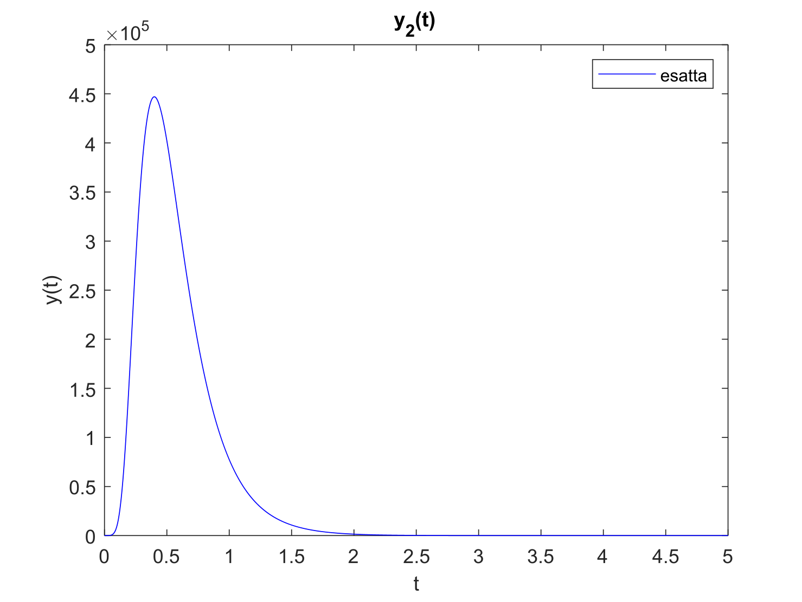
  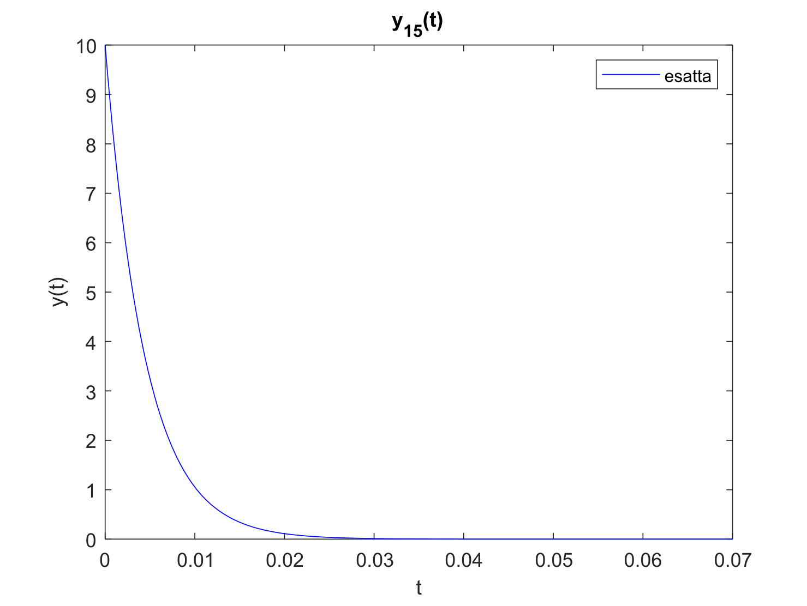
</p>

Possiamo osservare che essa presenta un picco iniziale nei primissimi valori di 𝑡, dove raggiunge anche valori di $10^7$ nella prima componente 
e $10^5$ nella seconda componente, tuttavia dopo il picco iniziale essa decade molto velocemente, anche solo per $t=30$ il vettore soluzione ha norma euclidea dell’ordine di $10^{-5}$, mentre per $t=10,000$ tutte le componenti della soluzione esatta hanno valore indistinguibile da zero in aritmetica finita.  
Dal momento che la funzione soluzione presenta valori così elevati, risulta significativo anche lo studio dell'errore relativo, oltre a quello dell'errore
assoluto.


## Il metodo di Radau IIA
Il metodo di [Radau_IIA](./Metodi_Numerici/Radau_IIA_5.m) è un metodo numerico di Runge-Kutta basato sul metodo di collocazione Radau IIA a tre stadi, 
si tratta di un metodo di ordine $5$ ed L-stabile. Il presente metodo è stato implementato su mesh omogenea.  
La L-stabilità permette di smorzare efficacemente le componenti associate agli autovalori grandi in modulo. Il prezzo da pagare è che il metodo è anche costoso da un punto di vista computazionale: per ogni nodo della mesh il metodo richiede di risolvere un sistema $45 \times 45$, tuttavia, in questo particolare 
caso dove il sistema di ODE è lineare e la mesh è omogenea, non solo i sistemi da risolvere numericamente sono lineari, ma la matrice $A$ che descrive 
il sistema $Ax_n = b_n$ è sempre la stessa per tutto il metodo, cambia solo il termine noto $b_n$, ciò consente di utilizzare la fattorizzazione $LU$
una volta per tutte all’inizio ed abbattere così il costo computazionale richiesto per risolvere i sistemi ad un costo quadratico di operazioni macchina (*flops*).

Seguono alcuni grafici per rappresentare la soluzione approssimata. I tre grafici seguenti mostrano la prima componente 
$y_1(t)$ del vettore soluzione $\underline{y}(t)$ e sono stati tutti e tre prodotti utilizzando come parametri $t_0 = 0$ e $T = 50$ , 
inoltre nella prima immagine $h = 1$, nella seconda $h = 0.1$, nella terza $h = 0.01$. È decisamente soddisfacente osservare come con anche solo $h = 0.1$
e dunque $N = 501$ nodi (un numero quasi sempre irrisorio quando si parla di cardinalità di una mesh) il metodo produca un errore relativo di $10^{-4}$, 
risultando quindi decisamente affidabile.

<table>
  <tr>
    <td align="center" width="33%">
      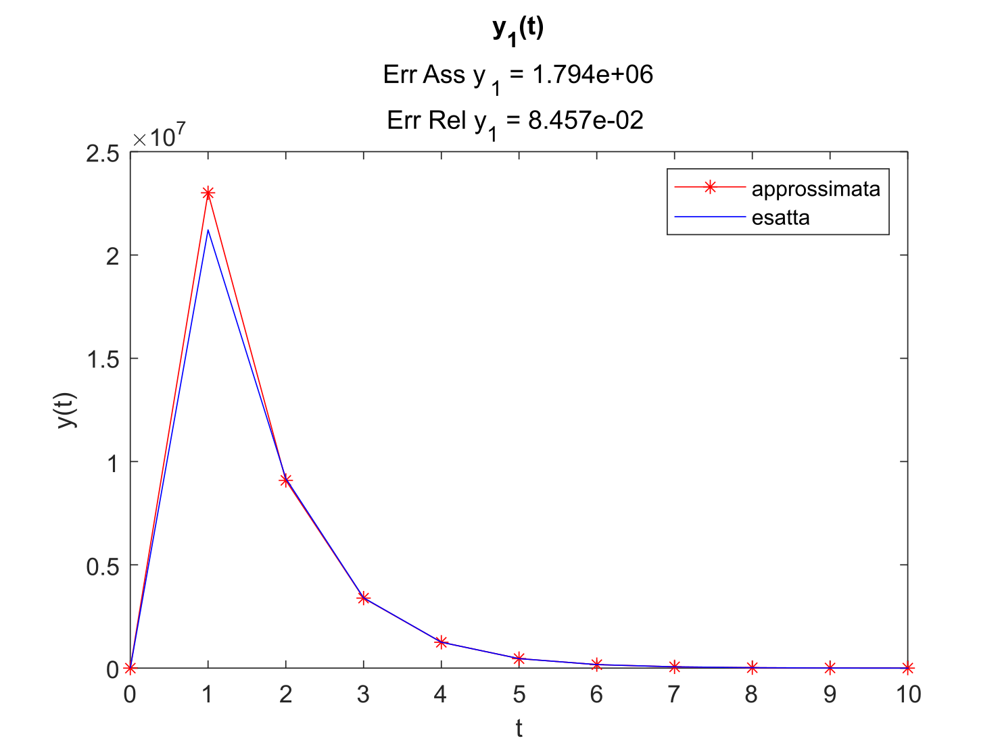
      <br>
      <em>t</em><sub>0</sub> = 0, &nbsp;
      <em>T</em> = 50, &nbsp;
      <em>h</em> = 1
    </td>
    <td align="center" width="33%">
      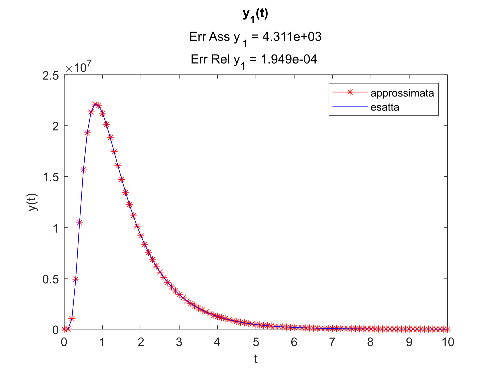
      <br>
      <em>t</em><sub>0</sub> = 0, &nbsp;
      <em>T</em> = 50, &nbsp;
      <em>h</em> = 0.1
    </td>
    <td align="center" width="33%">
      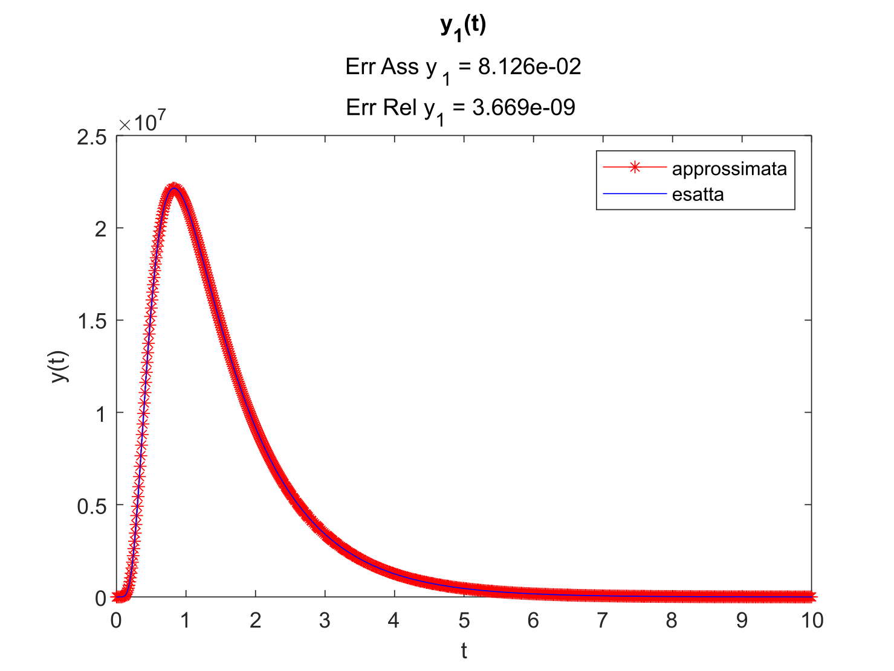
      <br>
      <em>t</em><sub>0</sub> = 0, &nbsp;
      <em>T</em> = 50, &nbsp;
      <em>h</em> = 0.01
    </td>
  </tr>
</table>
<br>


Seguono inoltre le tabelle degli errori commessi:
<br>
<br>


<table>
  <tr>
    <td width="50%" valign="middle">
      <table width="100%">
        <tr>
          <th colspan="3"><em>T</em> = 10</th>
        </tr>
        <tr>
          <th>Numero<br>di nodi</th>
          <th>Errore di discretizzazione<br>globale</th>
          <th>Errore relativo</th>
        </tr>
        <tr>
          <td align="center">100</td>
          <td align="center">4.35928e+03</td>
          <td align="center">1.97120e-04</td>
        </tr>
        <tr>
          <td align="center">1,000</td>
          <td align="center">8.13346e-02</td>
          <td align="center">3.67199e-09</td>
        </tr>
        <tr>
          <td align="center">10,000</td>
          <td align="center">1.27448e-06</td>
          <td align="center">5.75384e-14</td>
        </tr>
        <tr>
          <td align="center">100,000</td>
          <td align="center">2.64496e-07</td>
          <td align="center">1.19411e-14</td>
        </tr>
      </table>
    </td>
    <td width="50%" valign="middle">
      <table width="100%">
        <tr>
          <th colspan="3"><em>T</em> = 10,000</th>
        </tr>
        <tr>
          <th>Numero<br>di nodi</th>
          <th>Errore di discretizzazione<br>globale</th>
          <th>Errore relativo</th>
        </tr>
        <tr>
          <td align="center">100,000</td>
          <td align="center">4.35928e+03</td>
          <td align="center">1.97120e-04</td>
        </tr>
        <tr>
          <td align="center">1,000,000</td>
          <td align="center">8.13346e-02</td>
          <td align="center">3.67199e-09</td>
        </tr>
      </table>
    </td>
  </tr>
</table>


## Il metodo di Gauss-Legendre su mesh non omogenea

Come descritto sopra, i problemi stiff forzano ad utilizzare un passo molto più piccolo del necessario per approssimare la soluzione, tuttavia, un passo così
piccolo è necessario per descrivere efficacemente la soluzione unicamente in un intervallo molto ristretto di valori, altrove si può tranquillamente utilizzare un
passo molto più ampio. È qui che le mesh omogenee mostrano i loro limiti e si è di conseguenza deciso di implementare anche dei metodi su una mesh non omogenea.
L'idea implementativa è stata quella di discretizzare con un passo $h_1$ l’intervallo $\[t_0 , 20\]$, con un passo $h_2$ l’intervallo $\[20,100\]$, e con un 
passo $h_3$ l’intervallo $\[100,𝑇\]$, con l’accortezza di scegliere $h_1$ estremamente piccolo ed $h_3$ estremamente grande.  
L'idea è in questo caso vincente. Il prezzo da pagare è che essendo la mesh non omogenea non è più possibile utilizzare la fattorizzazione $LU$ per abbattere il
costo computazionale, tuttavia, il costo computazionale da pagare per rinunciare alla fattorizzazione $LU$ è abbondantemente compensato dall’abbattere 
drasticamente il numero di sistemi lineari da risolvere.  
Il [metodo di Gauss-Legendre](./Metodi_Numerici/Gauss_Legendre_2_6.m) è anch'esso un metodo di Runge-Kutta basato su un metodo di collocazione, solo che ora viene utilizzata un'interpolazione di 
Gauss-Legendre. Il metodo implementato è un metodo di Gauss-Legendre a 3 stadi, e dunque di ordine 6. A differenza del metodo di Radau IIA, il metodo di 
Gauss-Legendre è solo A-stabile, e non L-stabile.

<table>
  <tr>
    <td width="60%" align="center" valign="middle">
      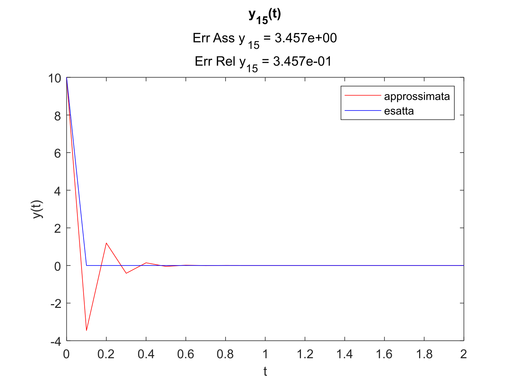
    </td>
    <td width="40%" valign="middle">
      <strong>Parametri utilizzati</strong><br>
      <em>t</em><sub>0</sub> = 0, &nbsp;
      <em>T</em> = 10,000<br>
      <em>h</em><sub>1</sub> = 0.1, &nbsp;
      <em>h</em><sub>2</sub> = 1, &nbsp;
      <em>h</em><sub>3</sub> = 10
      <br><br>
      Un passo <em>h</em><sub>1</sub> troppo grande introduce delle oscillazioni nella componente
      <em>u</em><sub>15</sub> della soluzione approssimata, a causa della mancanza di L-stabilità.
      La A-stabilità del metodo provvede comunque a smorzare progressivamente tali oscillazioni.
    </td>
  </tr>
</table>
<br>
<br>

Le oscillazioni compaiono solo sulla $15$-esima componente poiché è la dinamica con autovalore più alto in modulo, per osservare oscillazioni anche 
sulle altre componenti bisognerebbe prendere un passo $h_1$ ancora più grande, che però introdurrebbe un errore assoluto eccessivo, rendendo la 
soluzione approssimata trovata priva di qualunque significato.
Non è un caso che oscillazioni sulle altre componenti siano difficili da osservare: la A-stabilità è una proprietà matematica decisamente forte e che 
comunque rende il metodo incondizionatamente assolutamente stabile.

L’immagine seguente mette in luce come appare la soluzione su una mesh non omogenea:

<table>
  <tr>
    <td width="60%" align="center" valign="middle">
      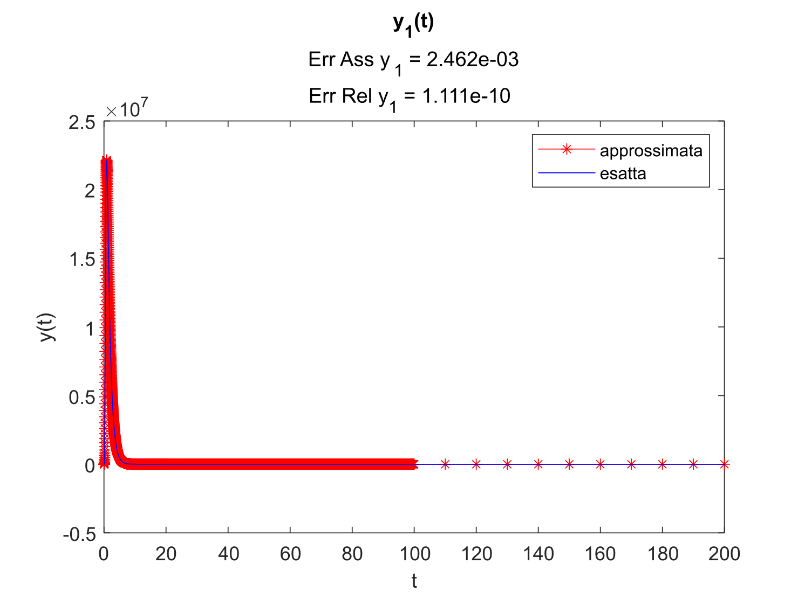
    </td>
    <td width="40%" valign="middle">
      <strong>Parametri utilizzati</strong><br>
      <em>t</em><sub>0</sub> = 0, &nbsp;
      <em>T</em> = 10,000<br>
      <em>h</em><sub>1</sub> = 0.01, &nbsp;
      <em>h</em><sub>2</sub> = 0.1, &nbsp;
      <em>h</em><sub>3</sub> = 10
      <br><br>
      La mesh è più densa negli istanti iniziali, dove la soluzione presenta i transitori più veloci,
      e diventa progressivamente più sparsa negli istanti finali.
    </td>
  </tr>
</table>
<br>
<br>

Forniamo infine una tabella con gli errori fissati i parametri $t_0 = 0$ ed $T=10,000$.

<table align="center">
  <tr>
    <th align="center">Num. nodi</th>
    <th align="center">Err. Ass.</th>
    <th align="center">Err. Rel.</th>
    <th align="center">
      Scelta dei passi:
      <em>h</em><sub>1</sub> in [<em>t</em><sub>0</sub>, 20],
      <em>h</em><sub>2</sub> in [20, 100],
      <em>h</em><sub>3</sub> in [100, <em>T</em>]
    </th>
  </tr>
  <tr>
    <td align="center">291</td>
    <td align="center">6.69894e+02</td>
    <td align="center">3.02915e-05</td>
    <td align="center"><em>h</em><sub>1</sub> = 0.1, &nbsp; <em>h</em><sub>2</sub> = 1, &nbsp; <em>h</em><sub>3</sub> = 1000</td>
  </tr>
  <tr>
    <td align="center">2,900</td>
    <td align="center">1.66442e-02</td>
    <td align="center">7.51429e-10</td>
    <td align="center"><em>h</em><sub>1</sub> = 0.01, &nbsp; <em>h</em><sub>2</sub> = 0.1, &nbsp; <em>h</em><sub>3</sub> = 100</td>
  </tr>
  <tr>
    <td align="center">20,180</td>
    <td align="center">5.34687e-07</td>
    <td align="center">2.41393e-14</td>
    <td align="center"><em>h</em><sub>1</sub> = 0.001, &nbsp; <em>h</em><sub>2</sub> = 1, &nbsp; <em>h</em><sub>3</sub> = 100</td>
  </tr>
  <tr>
    <td align="center">21,791</td>
    <td align="center">1.08034e-07</td>
    <td align="center">4.87737e-15</td>
    <td align="center"><em>h</em><sub>1</sub> = 0.001, &nbsp; <em>h</em><sub>2</sub> = 0.1, &nbsp; <em>h</em><sub>3</sub> = 10</td>
  </tr>
  <tr>
    <td align="center">100,000</td>
    <td align="center">6.69894e+02</td>
    <td align="center">3.02915e-05</td>
    <td align="center"><em>h</em> = 0.1, mesh omogenea</td>
  </tr>
  <tr>
    <td align="center">1,000,000</td>
    <td align="center">1.66442e-02</td>
    <td align="center">7.51429e-10</td>
    <td align="center"><em>h</em> = 0.01, mesh omogenea</td>
  </tr>
</table>

È interessante osservare come, lavorare con $2,900$ nodi in mesh non omogenea, oppure lavorare con $1,000,000$ nodi in mesh omogenea, produca in realtà 
lo stesso errore. Il vantaggio di utilizzare una mesh non omogenea è qui inequivocabile.


## Il metodo di Gauss-Legendre adattivo

Se non si vuole utilizzare una mesh omogenea, si può optare anche per una mesh adattiva.  
I metodi adattivi sono metodi numerici in cui la mesh non è fissata a priori ma i suoi nodi sono calcolati in fase di esecuzione del programma, 
sulla base di una stima dell’errore. In ogni nodo si determina automaticamente quanto vale il passo di discretizzazione successivo. In questo
particolare problema i metodi adattivi risultano particolarmente efficaci.  
Il metodo di [Gauss-Legendre 2(6)](./Metodi_Numerici/Gauss_Legendre_2_6.m) è un metodo di Runge Kutta implicito adattivo embedded, ciò significa che 
esistono due metodi di Gauss-Legendre, 
uno di ordine 2 ed uno di ordine 6, che condividono lo stesso Tableau di Butcher, eccezion fatta per il vettore $b$.  
Il vantaggio è considerevole: risolvendo gli stessi sistemi lineari e cambiando solo i pesi $b$ delle combinazioni lineari (il costo computazionale di 
ciò è assolutamente irrisorio) abbiamo a disposizione due soluzioni una A-stabile di ordine 6, ed un’altra di ordine 2.
Trattando la soluzione ottenuta col metodo di ordine superiore come se fosse la soluzione esatta e calcolando lo scarto tra le due soluzioni si ha a 
disposizione un valore che può essere considerato uno stimatore dell’errore assoluto.  
Se lo scarto è inferiore ad una tolleranza fissata si accetta il valore trovato inserendolo nella mesh e poi si procede a calcolare il nuovo passo $h_n$, 
in caso alternativo, si ripete il calcolo riducendo il passo. Infine, si tiene memorizzata come soluzione numerica la soluzione fornita dal metodo di ordine 6.  
<br>
Segue una tabella contenente i vari errori al variare della tolleranza, ($t_0 = 0$ , $T = 10,000$):


<table align="center">
  <tr>
    <th align="center">Tolleranza</th>
    <th align="center">Numero nodi</th>
    <th align="center">Err. Ass.</th>
    <th align="center">Err. Rel.</th>
    <th align="center"><em>h</em><sub>min</sub></th>
    <th align="center"><em>h</em><sub>max</sub></th>
  </tr>
  <tr><td align="center">1e+5</td><td align="center">38</td><td align="center">1.32016e+02</td><td align="center">5.97904e-06</td><td align="center">0.001</td><td align="center">7515.21744</td></tr>
  <tr><td align="center">1e+4</td><td align="center">70</td><td align="center">1.62036e+01</td><td align="center">7.31537e-07</td><td align="center">0.001</td><td align="center">7552.67047</td></tr>
  <tr><td align="center">1e+3</td><td align="center">138</td><td align="center">3.22138e-01</td><td align="center">1.45438e-08</td><td align="center">0.001</td><td align="center">7452.33204</td></tr>
  <tr><td align="center">1e+2</td><td align="center">281</td><td align="center">2.18029e-02</td><td align="center">9.84334e-10</td><td align="center">0.001</td><td align="center">5030.59686</td></tr>
  <tr><td align="center">1e+1</td><td align="center">589</td><td align="center">7.42305e-04</td><td align="center">3.35125e-11</td><td align="center">0.001</td><td align="center">8677.20076</td></tr>
  <tr><td align="center">1e+0</td><td align="center">1,254</td><td align="center">7.42405e-05</td><td align="center">3.35171e-12</td><td align="center">0.00096</td><td align="center">8649.32396</td></tr>
  <tr><td align="center">1e-1</td><td align="center">2,687</td><td align="center">6.57684e-06</td><td align="center">2.96922e-13</td><td align="center">0.00045</td><td align="center">7031.06471</td></tr>
  <tr><td align="center">1e-2</td><td align="center">5,774</td><td align="center">7.13678e-07</td><td align="center">3.22201e-14</td><td align="center">0.00021</td><td align="center">4776.71363</td></tr>
  <tr><td align="center">1e-3</td><td align="center">12,423</td><td align="center">1.86265e-07</td><td align="center">8.40921e-15</td><td align="center">0.00010</td><td align="center">7578.50364</td></tr>
  <tr><td align="center">1e-4</td><td align="center">26,748</td><td align="center">1.37839e-07</td><td align="center">6.22294e-15</td><td align="center">0.00004</td><td align="center">7133.44752</td></tr>
</table>


È inoltre particolarmente interessante osservare come anche fissando una tolleranza enorme di $10^4$, il metodo numerico produca, con solo $70$ nodi, un 
errore assoluto dell’ordine delle decine per approssimare variabili che viaggiano su grandezze nell’ordine delle decine di milioni.  
Il costo computazionale è assolutamente irrisorio, richiedendo al più qualche secondo per tolleranze inferiori a $10^{−4}$, e diventando pressoché 
istantaneo per tolleranze superiori a $10^{−2}$.  
<br>
Segue una progressione di immagini che descrive con diversi livelli di zoom l’approssimazione di $y_1(t)$, con $t_0 = 0$ , $T = 10,000$, 
$toll = 10^4$, $Num nodi = 70$, le quattro immagini seguenti sono viste rispettivamente con zoom negli intervalli:
$[0, 20]$, $[0, 50]$, $[0, 220]$ ed $[0, 10,000]$. 

<table align="center">
  <tr>
    <td width="50%" align="center" valign="middle">
      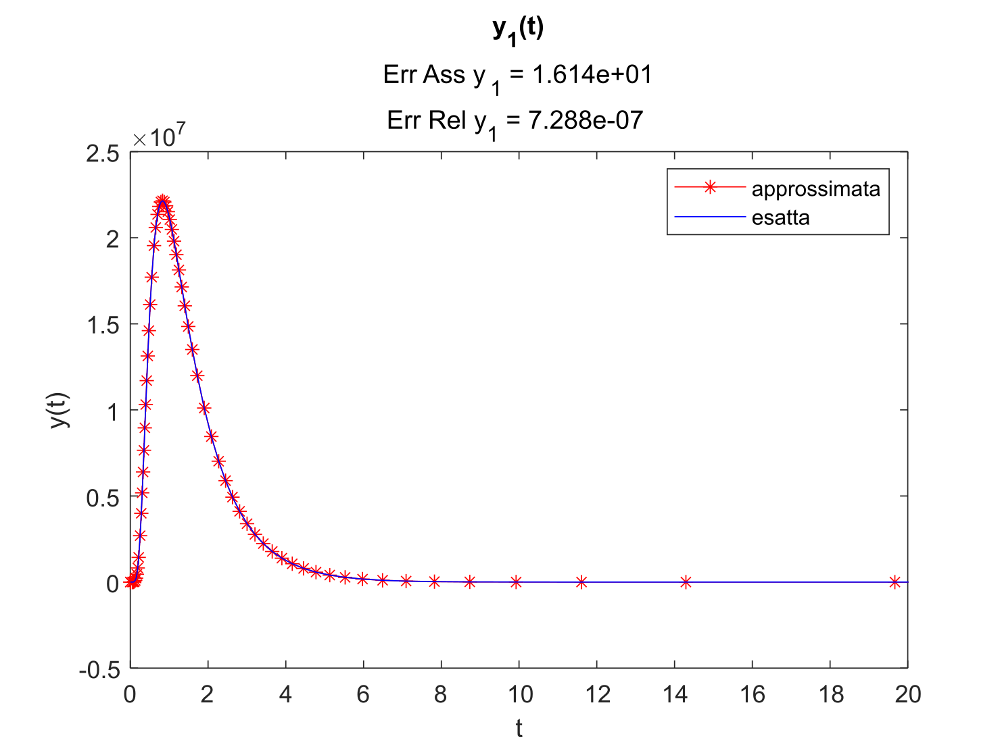
      <br>
      <em>t</em> ∈ [0, 20]
    </td>
    <td width="50%" align="center" valign="middle">
      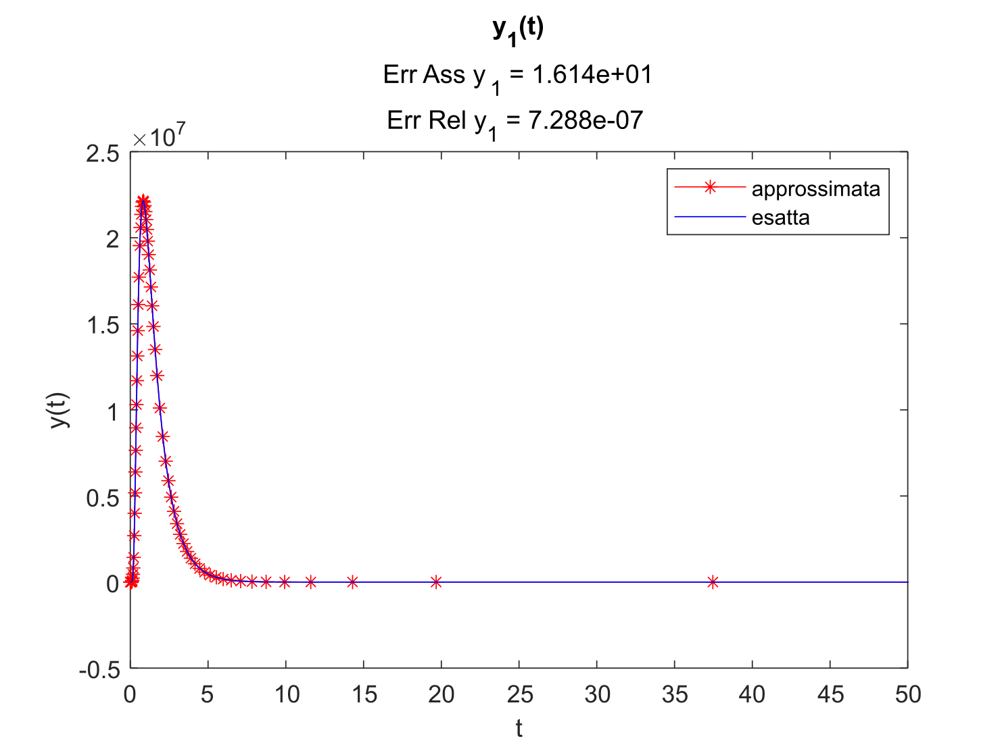
      <br>
      <em>t</em> ∈ [0, 50]
    </td>
  </tr>
  <tr>
    <td width="50%" align="center" valign="middle">
      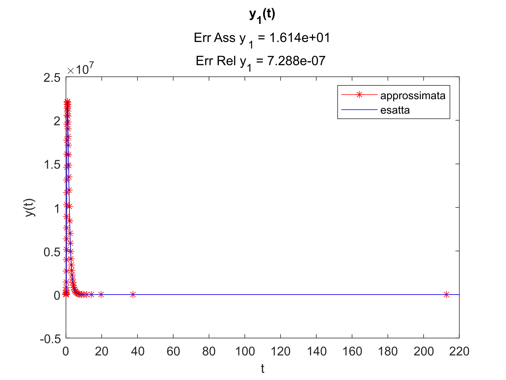
      <br>
      <em>t</em> ∈ [0, 220]
    </td>
    <td width="50%" align="center" valign="middle">
      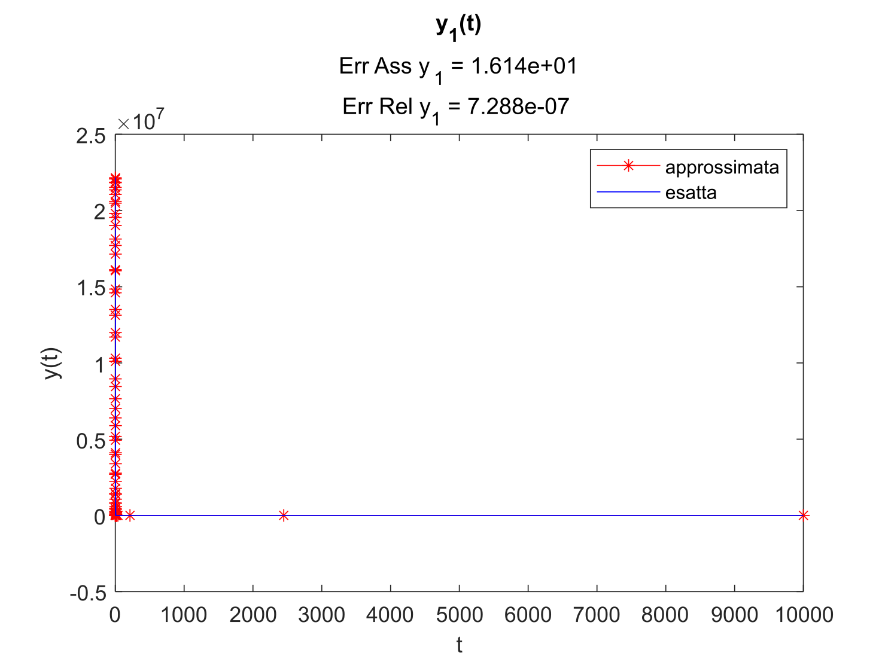
      <br>
      <em>t</em> ∈ [0, 10,000]
    </td>
  </tr>
</table>


## Altri metodi implementati

Il repository comprende inoltre i seguenti metodi numerici:
- [BDF 2](./Metodi_Numerici/BDF_2.m) e [BDF 3](./Metodi_Numerici/BDF_3.m) a passo costante;  
- [Crank-Nicolson su mesh non omogenea](./Metodi_Numerici/Crank_Nicolson_mesh_non_omogenea.m);  
- [Eulero implicito](./Metodi_Numerici/Eulero_Implicito.m);  
- [Pareschi-Russo](./Metodi_Numerici/Pareschi_Russo.m);  
- [Runge-Kutta](./Metodi_Numerici/Runge_Kutta_4.m) classico di ordine 4;  
- [Runge-Kutta-Fehlberg 4(5)](./Metodi_Numerici/Runge_Kutta_Fehlberg_4_5.m) adattivo.  

La trattazione, l'analisi ed i risultati relativi a questi metodi vengono discussi nella [relazione completa](./Analisi_di_stabilità.pdf).


## Esecuzione

1. Aprire la cartella del repository in MATLAB o GNU Octave.
2. Aprire [main.m](./main.m) e impostare la variabile `metodo`, per esempio:

   ```matlab
   metodo = 'Radau_IIA_5';
   % metodo = 'Gauss_Legendre_6_mesh_non_omogenea';
   % metodo = 'Gauss_Legendre_2_6';
   ```

3. Modificare, se lo si desidera, i parametri `t_0`, `T`, il passo `h` uniforme, i tre passi della mesh non omogenea `passo_1`, `passo_2` e `passo_3`,
    oppure la tolleranza `toll` del metodo adattivo.
4. Eseguire `main.m`.

Lo script genererà i dati iniziali, calcolerà la soluzione numerica e quella esatta, stamperà gli errori e produrrà i grafici delle componenti $y_1$, 
$y_2$ e $y_{15}$.


## Limiti dell'implementazione

I solver numerici sono stati implementati ed ottimizzati per questo specifico esperimento: assumono un sistema autonomo lineare $y  \hspace{0.1cm}'=My$ di
dimensione $15$ e non costituiscono una libreria ODE per un generale sistema di equazioni differenziali.  
Questa scelta permette di mettere in evidenza le proprietà numeriche dei metodi e di sfruttare direttamente la struttura lineare del problema per ottimizzare
il costo computazionale richiesto dai metodi numerici.


